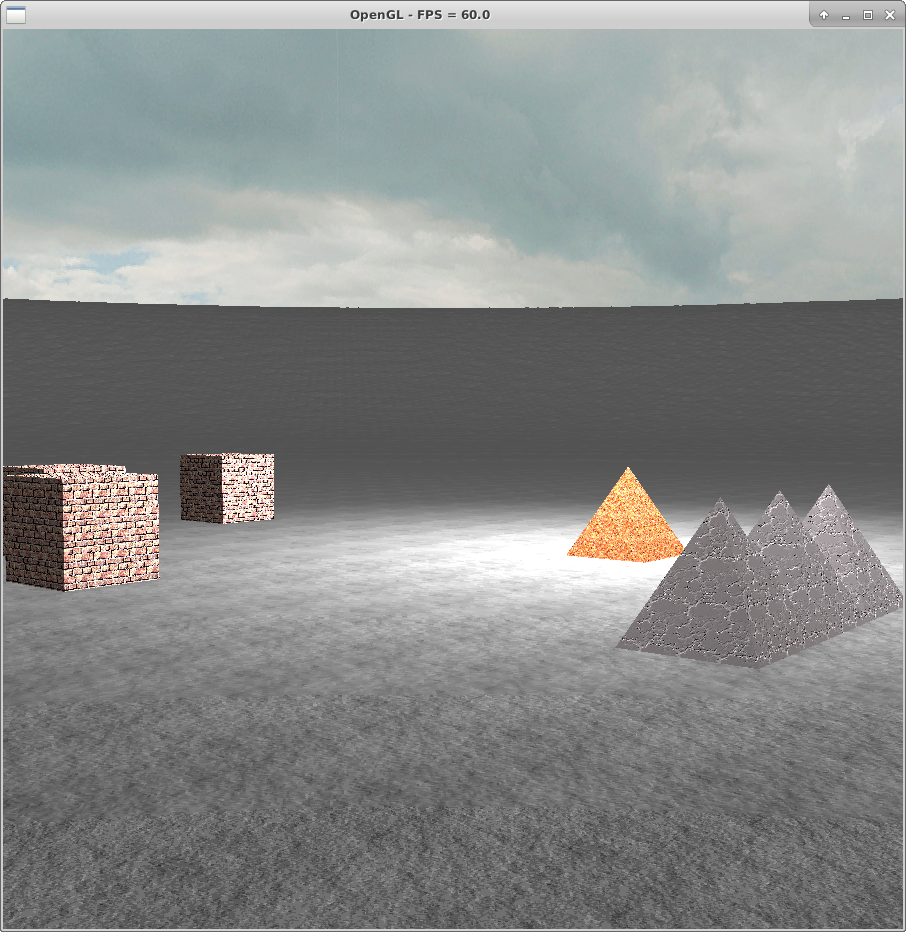

GameEngine

A simple game engine I'm working on in my spare time.

Features:
- Can load a heightmap from a grayscale image file
- Textured objects
- Skybox
- Per-vertex lighting
- Controllable camera that can automatically follow the terrain height

Dependencies:
- C compiler
- OpenGL
- OpenGL Extension Wrangler (GLEW)
- GLFW
- stb image library

Build Instructions:
- gcc -I /path/to/stb \*.c -lGL -lGLEW -lGLFW -lm

Art Assets (With thanks):
- The object textures are from GNU Image Manipulation Program (GIMP)
- The skyboxes were taken from http://opengameart.org/content/cloudy-skyboxes

